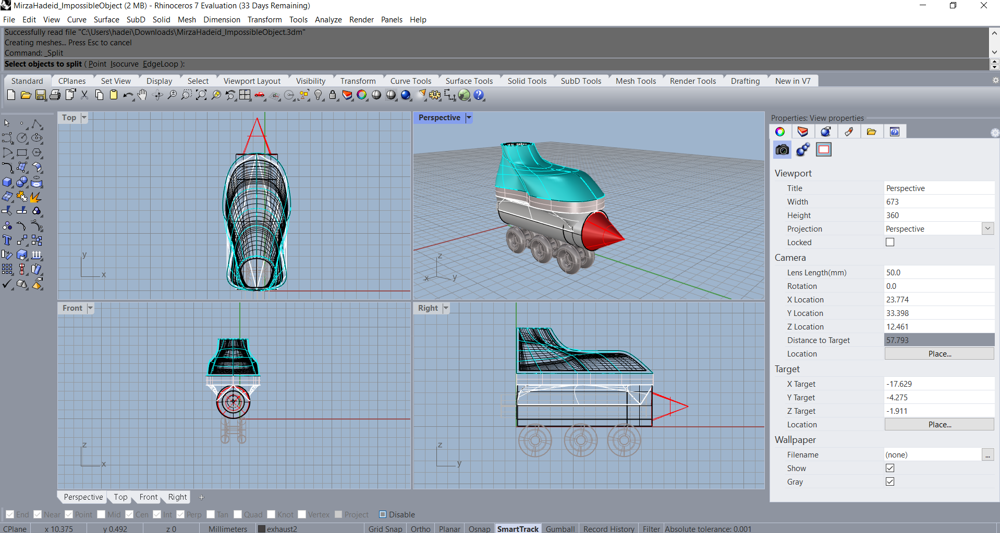
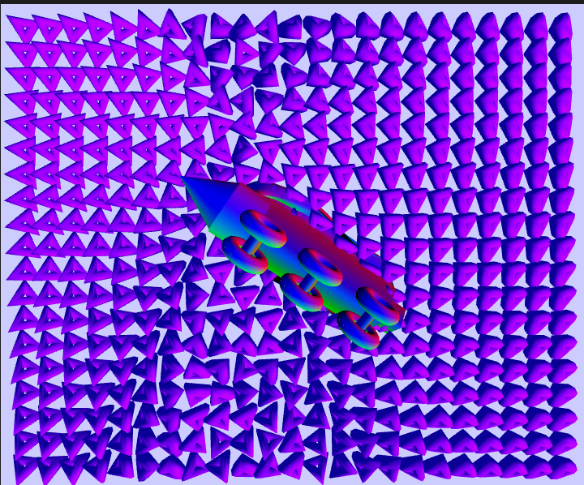

# Rocket Skates 

## Overview

This is one of my projects from when I took [ART 107](https://guide.wisc.edu/courses/art/) (Introduction to Digital Forms) at UW-Madison. It's a simple interactive art piece that was created with the [p5.js](https://p5js.org/) library.  

The rotating skates in the window is something that I 3D modelled using the [Rhino](https://www.rhino3d.com/) 3D modelling software.

 

To interact with the canvas, you can move your mouse around and the 3D shapes will interact with wherever the mouse lies on the screen.

  

Additionally, you can also change the dimensions of the Torus shape using the slider in the bottom left side of the page.

 

Finally, the canvas adapts to the screen size of the user!

live webpage: [https://hadeidm.github.io/crazy-skates/](https://hadeidm.github.io/crazy-skates/) (Might be pretty slow)
